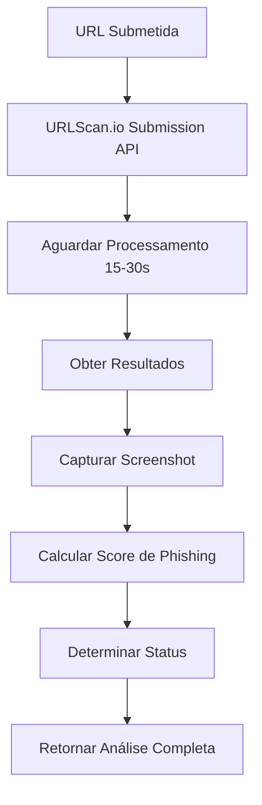

# 🎯 Análise de Phishing - URLScan.io

## 📋 Visão Geral

O Sentinel-Pelanda agora inclui uma funcionalidade avançada de análise de phishing usando a API do URLScan.io. Esta funcionalidade permite:

- 📸 **Screenshots automáticos** das páginas suspeitas
- 🔍 **Análise comportamental** da página
- 🏷️ **Detecção de marcas** personificadas
- 📊 **Score de phishing** baseado em múltiplos indicadores
- 🔗 **Análise de redirecionamentos** e links externos

## 🔧 Configuração

### Variáveis de Ambiente

Adicione a seguinte variável ao arquivo `.env` do backend:

```env
# URLScan.io API para análise de phishing
URLSCAN_API_KEY=your-urlscan-api-key-here
```

### Obtendo API Key do URLScan.io

1. Acesse [URLScan.io](https://urlscan.io/)
2. Crie uma conta gratuita
3. Vá para **Settings** → **API Keys**
4. Gere uma nova API key
5. Adicione a key no arquivo `.env`

## 🚀 Como Usar

### Interface Web

1. Acesse a tela de **Verificação de Ameaças**
2. Selecione a aba **Phishing**
3. Cole as URLs suspeitas (uma por linha)
4. Clique em **Verificar Ameaças**

### Exemplo de URLs para Teste

```
https://suspicious-bank-login.com
https://paypal-verify-account.net
https://amazon-security-update.org
```

## 📊 Informações Exibidas

### Screenshot da Página
- Captura visual da página analisada
- Link direto para análise completa no URLScan.io
- Fallback caso a imagem não esteja disponível

### Indicadores de Phishing
- **Score de Phishing**: 0-100% baseado em múltiplos fatores
- **Marca Detectada**: Identifica tentativas de personificação
- **Certificado SSL**: Validade do certificado de segurança
- **Idade do Domínio**: Domínios muito novos são suspeitos

### Análise Técnica
- **Tecnologias**: Frameworks e tecnologias detectadas
- **Redirecionamentos**: Número de redirecionamentos suspeitos
- **Formulários Suspeitos**: Detecção de formulários de login/pagamento
- **Links Externos**: Quantidade de links para domínios externos

### Recomendações
- **Phishing Confirmado**: Ações imediatas de bloqueio
- **Suspeita de Phishing**: Monitoramento e controles adicionais
- **Sem Indicadores**: Vigilância contínua recomendada

## 🔄 Fluxo de Análise



## 📈 Métricas de Score

### Score de Phishing (0-100%)
- **0-39%**: Baixo risco (Status: Limpo)
- **40-74%**: Risco moderado (Status: Suspeito)
- **75-100%**: Alto risco (Status: Malicioso)

### Fatores Considerados
- Score base do URLScan.io
- Detecção de malware (+30 pontos)
- Categorias suspeitas (+5 por categoria)
- Marcas detectadas (+10 por marca)

## 🛡️ Recursos de Segurança

### Rate Limiting
- Máximo de 3 URLs processadas simultaneamente
- Pausa de 2 segundos entre lotes
- Timeout de 60 segundos por análise

### Privacidade
- Scans marcados como "unlisted" no URLScan.io
- Dados não aparecem em buscas públicas
- Visível apenas para pesquisadores de segurança

### Cache
- Resultados em cache por 4 horas
- Evita re-análises desnecessárias
- Melhora performance e reduz custos

## 🎯 Casos de Uso

### Para Equipes SOC
- Triagem rápida de URLs suspeitas
- Análise visual de páginas de phishing
- Geração de relatórios com evidências

### Para Analistas de Segurança
- Investigação de campanhas de phishing
- Identificação de marcas sendo personificadas
- Análise de infraestrutura maliciosa

### Para CERT/CSIRT
- Resposta a incidentes de phishing
- Análise forense de ataques
- Documentação com screenshots

## 🔧 Troubleshooting

### "URLScan not configured"
- Verifique se a API key está no arquivo `.env`
- Confirme que a key é válida no URLScan.io
- Reinicie o backend após adicionar a key

### "Rate limit exceeded"
- URLScan.io tem limites de API
- Aguarde alguns minutos antes de tentar novamente
- Considere upgrade do plano URLScan.io se necessário

### "Timeout waiting for result"
- Análise pode demorar mais que o esperado
- Verifique se a URL é acessível
- Tente novamente após alguns minutos

## 📊 Comparação com Outras Análises

| Tipo | API Principal | Foco | Screenshot |
|------|---------------|------|------------|
| IP | VirusTotal + AbuseIPDB | Reputação de IP | ❌ |
| URL | VirusTotal | Detecção de malware | ❌ |
| Hash | VirusTotal | Análise de arquivo | ❌ |
| **Phishing** | **URLScan.io** | **Análise comportamental** | **✅** |

## 🔮 Funcionalidades Futuras

- [ ] Análise de DOM para detectar elementos suspeitos
- [ ] Integração com feeds de phishing (PhishTank, OpenPhish)
- [ ] Análise de similaridade visual com marcas conhecidas
- [ ] Detecção de kits de phishing conhecidos
- [ ] Relatórios consolidados de campanhas

---

**📝 Nota**: Esta funcionalidade requer uma conta válida no URLScan.io. O serviço gratuito tem limitações de rate limiting que podem afetar análises em lote.
