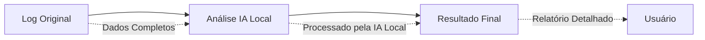
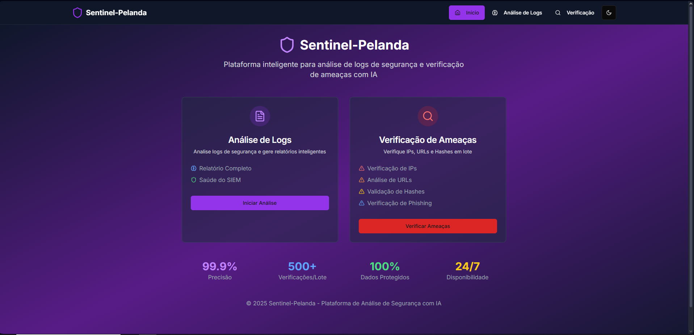
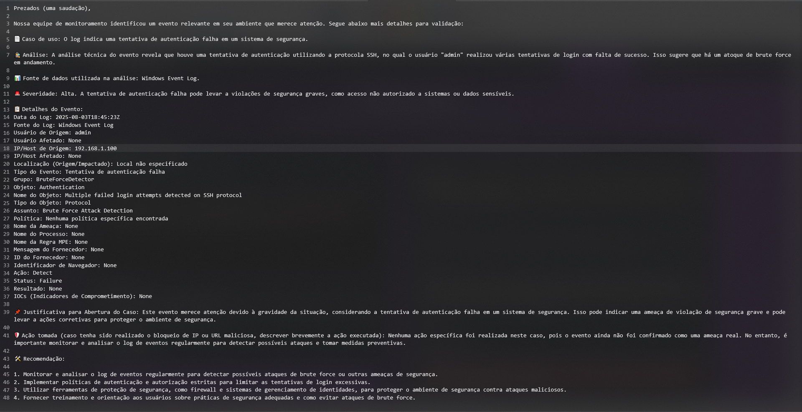
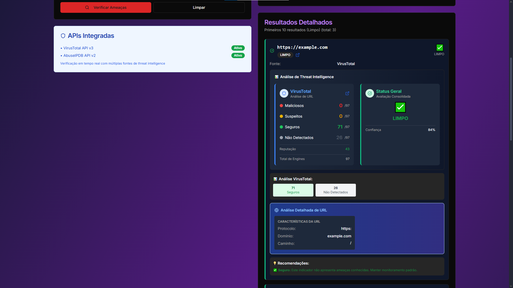

<p align="center">
🛡️ Sentinel-Pelanda
</p>

### Plataforma de Análise de Segurança com IA Local

<p align="center">
  <a href="https://www.docker.com/"></a>
  <a href="https://www.typescriptlang.org/"></a>
  <a href="https://nextjs.org/"></a>
  <a href="https://reactjs.org/"></a>
  <a href="LICENSE"></a>
</p>

<p align="center"><b>Plataforma completa para análise de logs e geração de Relatórios de segurança, verificação de ameaças e proteção avançada de dados sensíveis com Inteligência Artificial Local.</b></p>


## 📋 Índice

- [🎯 Visão Geral](#-visão-geral)
- [✨ Diferenciais](#-diferenciais)
- [🚀 Funcionalidades](#-funcionalidades)
- [🏗️ Arquitetura](#️-arquitetura)
- [🔄 Fluxo de Dados](#-fluxo-de-dados)
- [🛡️ Recursos de Segurança](#️-recursos-de-segurança)
- [📦 Tecnologias](#-tecnologias)
- [⚡ Instalação Rápida](#-instalação-rápida)
- [🔧 Configuração](#-configuração)
- [🌐 Deploy](#-deploy)
- [📚 Documentação](#-documentação)
- [🤝 Contribuição](#-contribuição)
- [📄 Licença](#-licença)


## 🎯 Visão Geral

O **Sentinel-Pelanda** é uma plataforma moderna e robusta para análise de segurança cibernética, combinando Inteligência Artificial Local, arquitetura escalável e proteção de dados sensíveis. Desenvolvida para equipes SOC, CERT, auditores e pesquisadores, oferece análise inteligente de logs, verificação de ameaças em tempo real e interface moderna.


### 🎯 Casos de Uso

- **SOC Teams**: Análise rápida e automatizada de logs de segurança
- **CERT/CSIRT**: Investigação e resposta a incidentes
- **Auditores**: Verificação de conformidade e rastreabilidade
- **Analistas**: Triagem e priorização de eventos de segurança
- **Pesquisadores**: Análise de ameaças, IOCs e tendências
## ✨ Diferenciais

- **100% IA Local**: Nenhum dado sensível sai do seu ambiente
- **Arquitetura Modular**: Separação clara entre frontend, backend e IA
- **Pronto para Produção**: Deploy rápido via Docker Compose
- **Customização Fácil**: Adapte modelos, integrações e relatórios
- **Documentação Completa**: Passo a passo para setup, uso e troubleshooting

## 🚀 Funcionalidades

### 🔍 Análise de Logs com IA
- **Análise Completa**: Relatórios detalhados com evidências estruturadas
- **Análise de Saúde**: Avaliação do estado de segurança do sistema
- **Múltiplos Formatos**: Suporte a logs XML, JSON, texto e Sysmon
- **Formato Customizado**: Relatórios padronizados com estrutura específica
- **IA Local**: Processamento offline com Ollama (Llama2, CodeLlama, Mistral)
- **Privacidade Total**: Dados processados localmente sem transmissão externa

### 🛡️ Verificação de Ameaças
- **IPs Maliciosos**: Verificação em VirusTotal e AbuseIPDB
- **URLs Suspeitas**: Análise de links e domínios
- **Hashes de Arquivos**: Verificação de malware conhecido
- **Relatórios Consolidados**: Resultados de múltiplas fontes

### 📊 Interface Moderna
- **Dashboard Responsivo**: Design adaptável para todos os dispositivos
- **Tema Escuro/Claro**: Interface personalizável
- **Componentes Modernos**: UI/UX com Shadcn/ui
- **Navegação Intuitiva**: Experiência de usuário otimizada


## 🏗️ Arquitetura

```text
Sentinel-Pelanda/
├── 🎨 frontend/                 # Next.js 15 + React 19 + TypeScript
│   ├── app/                    # App Router (Next.js 15)
│   ├── components/             # Componentes UI (Shadcn/ui)
│   ├── hooks/                  # Custom React Hooks
│   └── utils/                  # Utilitários
├── ⚙️ backend/                  # Express.js + Node.js + TypeScript
│   ├── src/
│   │   ├── controllers/        # Lógica de negócio
│   │   ├── services/           # Serviços (IA Local, APIs externas, TI)
│   │   ├── routes/             # Definição de rotas
│   │   ├── middleware/         # Middlewares (segurança, logs)
│   │   ├── utils/              # Utilitários (ofuscação)
│   │   └── server.ts           # Servidor principal
│   └── package.json
├── 🤖 ollama/                   # IA Local (Ollama)
├── 🐳 docker-compose.yml       # Orquestração Docker
├── 📁 config/                  # Configurações de deploy
└── 📄 README.md
```

<p align="center">
🛡️ Sentinel-Pelanda
</p>


## 🔄 Fluxo de Dados



## 🛡️ Recursos de Segurança

### 🔒 Privacidade Total
- **Processamento Local**: Dados nunca saem do ambiente
- **Sem Transmissão**: Análise 100% offline
- **Controle Total**: Você controla todos os dados
- **Sem Dependências**: Sem APIs externas de IA

### 🛡️ Segurança da Aplicação
- **Rate Limiting**: Proteção contra ataques de força bruta
- **CORS**: Controle de origens permitidas
- **Helmet**: Headers de segurança HTTP
- **Validação**: Express-validator para inputs
- **Logging**: Auditoria completa de requisições

### 🔒 Proteção de Dados
- **Dados Locais**: Processamento exclusivamente local
- **Sem Ofuscação**: Dados completos para análise precisa
- **Logs Seguros**: Auditoria sem exposição de dados
- **Cache Seguro**: Armazenamento temporário protegido

## 📦 Tecnologias

### Frontend
| Tecnologia | Versão | Propósito |
|------------|--------|-----------|
| **Next.js** | 15.2.4 | Framework React com SSR |
| **React**   | 19 | Biblioteca de UI |
| **TypeScript** | 5 | Tipagem estática |
| **Tailwind CSS** | 3.4.17 | Framework CSS |
| **Shadcn/ui** | - | Componentes UI |
| **Radix UI** | - | Primitivos acessíveis |

### Backend
| Tecnologia | Versão | Propósito |
|------------|--------|-----------|
| **Node.js** | 18+ | Runtime JavaScript |
| **Express.js** | 4.21.2 | Framework web |
| **TypeScript** | 5 | Tipagem estática |
| **Ollama** | 0.4.7 | IA Local (Llama2, CodeLlama, Mistral) |
| **VirusTotal API** | - | Threat Intelligence |
| **AbuseIPDB API** | - | Threat Intelligence |

### DevOps & Infraestrutura
| Tecnologia | Propósito |
|------------|-----------|
| **Docker** | Containerização |
| **Docker Compose** | Orquestração |
| **Nginx** | Proxy reverso |
| **PM2** | Process manager |

## ⚡ Instalação Rápida

### Pré-requisitos
- **Docker** 20.10+
- **Docker Compose** 2.0+
- **Node.js** 18+ (para desenvolvimento)

### 🚀 Deploy com Docker (Recomendado)

```bash
# 1. Clone o repositório
git clone https://github.com/Leonardo-009/Sentinel-Pelanda
cd sentinel-pelanda

# 2. Configure as variáveis de ambiente
cp backend/env.example backend/.env
cp frontend/env.example frontend/.env

# 3. Edite as variáveis de ambiente
# Adicione suas chaves de API nos arquivos .env

# 4. Execute com Docker Compose
docker-compose up --build -d

# 5. Acesse a aplicação
# Frontend: http://localhost:3000
# Backend: http://localhost:3001
```

### 🔧 Desenvolvimento Local

```bash
# Backend
cd backend
npm install
npm run dev

# Frontend (em outro terminal)
cd frontend
npm install
npm run dev
```

## 🔧 Configuração

### Variáveis de Ambiente

#### Backend (`backend/.env`)
```env
# Servidor
PORT=3001
NODE_ENV=production
FRONTEND_URL=http://localhost:3000

# IA Local (Ollama)
LOCAL_AI_URL=http://localhost:11434
LOCAL_AI_MODEL=llama2

# Threat Intelligence
VIRUSTOTAL_API_KEY=your-virustotal-api-key
ABUSEIPDB_API_KEY=your-abuseipdb-api-key
URLSCAN_API_KEY

# Cache
CACHE_TTL=3600
CACHE_CHECK_PERIOD=600
```

#### Frontend (`frontend/.env`)
```env
NEXT_PUBLIC_BACKEND_URL=http://localhost:3001
NEXT_PUBLIC_APP_NAME=Sentinel-Pelanda
NEXT_PUBLIC_APP_VERSION=2.0.0
```

### 🔑 Configuração de IA Local

#### IA Local (Ollama) - OBRIGATÓRIO
1. Execute o script de setup: `./setup-local-ai.sh`
2. Ou siga a documentação: [LOCAL_AI_SETUP.md](LOCAL_AI_SETUP.md)
3. Configure o modelo: `LOCAL_AI_MODEL=llama2`

#### VirusTotal
1. Registre-se em [VirusTotal](https://www.virustotal.com/gui/join-us)
2. Obtenha sua API key
3. Adicione ao arquivo `backend/.env`

#### AbuseIPDB
1. Registre-se em [AbuseIPDB](https://www.abuseipdb.com/api)
2. Obtenha sua API key
3. Adicione ao arquivo `backend/.env`

#### URLScan
1. Registre-se em [URLScan](https://www.URLScan.io)
2. Obtenha sua API key
3. Adicione ao arquivo `backend/.env`

## 🌐 Deploy

### 🐳 Docker Compose (Produção)
```bash
# Deploy completo
docker-compose -f docker-compose.yml up -d

# Ver logs
docker-compose logs -f

# Parar serviços
docker-compose down
```

### ☁️ Deploy em Nuvem

#### Vercel (Frontend)
```bash
cd frontend
vercel --prod
```

#### Railway (Backend)
```bash
cd backend
railway login
railway init
railway up
```

#### VPS/Droplet
```bash
# Instalar Docker
curl -fsSL https://get.docker.com -o get-docker.sh
sh get-docker.sh

# Clonar e executar
git clone https://github.com/seu-usuario/sentinel-pelanda.git
cd sentinel-pelanda
docker-compose up -d
```

### 🔒 Configuração de Segurança

#### Nginx (Proxy Reverso)
```nginx
server {
    listen 80;
    server_name seu-dominio.com;
    
    location / {
        proxy_pass http://localhost:3000;
        proxy_set_header Host $host;
        proxy_set_header X-Real-IP $remote_addr;
    }
    
    location /api {
        proxy_pass http://localhost:3001;
        proxy_set_header Host $host;
        proxy_set_header X-Real-IP $remote_addr;
    }
}
```

#### SSL/HTTPS
```bash
# Certbot para Let's Encrypt
sudo apt install certbot python3-certbot-nginx
sudo certbot --nginx -d seu-dominio.com
```

## 📚 Documentação

### 📡 API Endpoints

#### Análise de Logs
```http
POST /api/analyze
Content-Type: application/json

{
  "logText": "seu log aqui",
  "provider": "gemini",
  "reportType": "completo"
}
```

#### Verificação de Ameaças
```http
POST /api/threats/verify
Content-Type: application/json

{
  "indicator": "8.8.8.8",
  "type": "ip"
}
```

#### Health Check
```http
GET /api/health
```

#### Cache Management
```http
GET /api/cache
DELETE /api/cache
```

### 🔧 Scripts Úteis

#### Desenvolvimento
```bash
# Backend
npm run dev          # Desenvolvimento
npm run build        # Build
npm run lint         # Linting

# Frontend
npm run dev          # Desenvolvimento
npm run build        # Build
npm run start        # Produção
```

#### Docker
```bash
# Rebuild específico
docker-compose build backend
docker-compose build frontend

# Logs
docker-compose logs -f backend
docker-compose logs -f frontend

# Shell
docker-compose exec backend sh
docker-compose exec frontend sh
```

### 🛠️ Troubleshooting

#### Problemas Comuns

**Erro: "API key not configured"**
```bash
# Verificar variáveis de ambiente
docker-compose exec backend env | grep API
```

**Erro: "Connection refused"**
```bash
# Verificar se os containers estão rodando
docker-compose ps
docker-compose logs
```

**Erro: "Rate limit exceeded"**
```bash
# Verificar configuração de rate limiting
# Aguardar 15 minutos ou ajustar limites
```

## 🤝 Contribuição

### 📋 Como Contribuir

1. **Fork** o projeto
2. **Clone** seu fork
3. **Crie** uma branch para sua feature
4. **Desenvolva** sua funcionalidade
5. **Teste** suas mudanças
6. **Commit** suas alterações
7. **Push** para sua branch
8. **Abra** um Pull Request

### 🧪 Testes

```bash
# Backend
npm run test
npm run lint

# Frontend
npm run test
npm run lint
```

### 📝 Padrões de Código

- **TypeScript**: Tipagem estática obrigatória
- **ESLint**: Configuração padrão
- **Prettier**: Formatação automática
- **Conventional Commits**: Padrão de commits

### 🐛 Reportando Bugs

1. Verifique se o bug já foi reportado
2. Crie uma issue com:
   - Descrição detalhada
   - Passos para reproduzir
   - Logs de erro
   - Ambiente (OS, versões)

## 📄 Licença

Este projeto está sob a licença **MIT**. Veja o arquivo [LICENSE](LICENSE) para mais detalhes.

```
MIT License

Copyright (c) 2025 Sentinel-Pelanda

Permission is hereby granted, free of charge, to any person obtaining a copy
of this software and associated documentation files (the "Software"), to deal
in the Software without restriction, including without limitation the rights
to use, copy, modify, merge, publish, distribute, sublicense, and/or sell
copies of the Software, and to permit persons to whom the Software is
furnished to do so, subject to the following conditions:

The above copyright notice and this permission notice shall be included in all
copies or substantial portions of the Software.
```
## Exemplos


## Exemplos

### Interface Web
<p align="center">
  
  <br/>
  <i>Dashboard principal da plataforma</i>
</p>

### Relatórios Gerados
<p align="center">
  
  <br/>
  <i>Exemplo de relatório de análise de ameaças</i>
</p>

### Análise de Indicadores
<p align="center">
  
  
  <br/>
  <i>Verificação de IPs e URLs suspeitas</i>
</p>

## 🙏 Agradecimentos

- **A todos que contribuíram ou apoiaram de alguma forma**

---


<p align="center">
  <b>Sentinel-Pelanda</b> — Desenvolvido para equipes SOC e análise de segurança com IA Local
</p>

<p align="center">
  <b>⭐ Se este projeto foi útil, considere dar uma estrela!</b>
</p>
